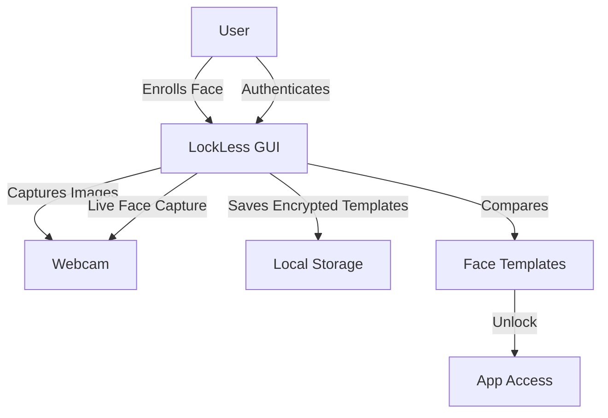

<p align="center">
	
</p>

<p align="center">
	<a href="https://github.com/SpicychieF05/LockLess-authenticator" target="_blank">
		
	</a>
	<a href="https://github.com/SpicychieF05/LockLess-authenticator" target="_blank">
		
	</a>
	<a href="https://github.com/SpicychieF05/LockLess-authenticator" target="_blank">
		
	</a>
</p>

<p align="center">
	<a href="#setup"></a>
	<a href="#features"></a>
	<a href="#system-architecture-diagram"></a>
	<a href="#use-case-chart"></a>
</p>

# LockLess: Face Authentication App

LockLess is a secure desktop application for face authentication using your webcam. Built with Python, OpenCV, and Tkinter, it is designed for privacy, simplicity, and robust local security on Windows.


## Features

🔐 **Secure Face Authentication**
- Real-time face recognition using advanced OpenCV algorithms
- Multi-pose enrollment system for enhanced accuracy
- Robust authentication across different lighting conditions and angles

🛡️ **Privacy-First Security**
- 100% offline operation - no internet connection required
- Local data storage with Windows DPAPI encryption
- Face templates stored securely, no actual images saved
- Zero cloud dependency for complete privacy protection

👤 **User-Friendly Interface**
- Intuitive GUI built with Tkinter for easy navigation
- Step-by-step enrollment process with clear instructions
- Real-time feedback during authentication attempts
- Simple setup with minimal user interaction required

⚡ **Performance & Reliability**
- Fast face detection and matching algorithms
- Configurable tolerance levels for authentication accuracy
- Liveness detection to prevent spoofing attempts
- Multi-frame verification for reliable access control

🔧 **Customizable Configuration**
- Adjustable face matching threshold settings
- Configurable number of required matches for unlock
- Customizable time windows for liveness detection
- Flexible enrollment process with multiple pose captures

📚 **Educational Purpose**
- Clean, well-documented codebase for learning
- Demonstrates biometric authentication principles
- Shows encryption and secure data storage practices
- Perfect for computer vision and security education

🖥️ **Windows Optimized**
- Native Windows integration with DPAPI encryption
- Optimized for Windows desktop environments
- Compatible with most webcam hardware
- Lightweight resource usage for smooth operation

---

## System Architecture Diagram



---

## Use Case Chart

| Use Case                | Description                                                      | User Benefit                |
|-------------------------|------------------------------------------------------------------|-----------------------------|
| Secure Login            | Unlock app with your face, no password needed                    | Fast, hands-free access     |
| Local Data Protection   | All face data encrypted and stored locally                       | Privacy, no cloud risk      |
| Multi-Pose Enrollment   | Robust recognition with varied poses and expressions             | Reliable authentication     |
| Personal Device Unlock  | Use as a gatekeeper for sensitive files or apps                  | Extra layer of security     |
| Educational Demo        | Learn about face recognition and encryption                      | Knowledge, experimentation  |
| No Internet Required    | Works fully offline                                              | Usable anywhere             |

---

---

## Setup

1. **Install Python 3.10+** (Windows recommended)
2. **Install dependencies:**
	 ```bash
	 pip install -r requirements.txt
	 ```
3. **Run the app:**
	 ```bash
	 python user_face_unlock.py
	 ```

---

## How It Works

1. **Enrollment:**
	 - On first run, the app will guide you to capture 5 live images:
		 1. Neutral face, looking straight
		 2. Smile
		 3. Turn head left
		 4. Turn head right
		 5. Remove/Put on glasses if you have

---

## 👨‍💻 **Developer Information**

### 🚀 **Built with ❤️ by Chirantan Mallick**
- 🎓 **BCA 3rd Year Student** at Seacom Skills University
- 💻 **Full Stack Developer** specializing in React & Modern Web Technologies
- 🌟 **Open Source Enthusiast** passionate about education technology

### 📞 **Connect with Developer**

<p align="center">
	<a href="https://discord.gg/EmRcW9rnGs">
		
	</a>
	<a href="https://rb.gy/uxjdk">
		
	</a>
	<a href="https://www.facebook.com/Chirantan2965">
		
	</a>
	<a href="https://instagram.com/heres_chirantan">
		
	</a>
	<a href="https://linkedin.com/in/chirantan-mallick">
		
	</a>
	<a href="https://x.com/Chirantan2965">
		
	</a>
	<a href="https://tr.ee/9Vp509xCxy">
		
	</a>
</p>


	 - The app extracts face features and saves them securely in:
		 ```
		 C:\Users\<your-username>\face_templates.dat
		 ```
1. **Authentication:**
	 - After enrollment, the app uses your webcam to authenticate you in real time.
	 - Recognition is robust to different conditions (lighting, pose, glasses).

---

## Usage

- **Start the app:**
	```bash
	python user_face_unlock.py
	```
- **Re-enroll:** Delete or rename `face_templates.dat` and run the app again.
- **Help:**
	```bash
	python user_face_unlock.py --help
	```

---

## Configuration

You can adjust these settings in `user_face_unlock.py`:

- `TOLERANCE` — Face matching threshold (default: 0.7)
- `LIVENESS_MATCHES_REQUIRED` — Number of matches needed to unlock (default: 3)
- `LIVENESS_WINDOW_SEC` — Time window for liveness detection (default: 5 seconds)

---

## Security & Privacy

- **Local Only:** No images or data are sent to the cloud.
- **Encrypted Storage:** Face templates are encrypted using Windows DPAPI.
- **No actual images are saved**—only processed face features.
- **For educational/personal use only.** Not a replacement for Windows login or critical security.

---

## Dependencies

- OpenCV (face detection)
- NumPy (numerical operations)
- Pillow (image processing)
- pywin32 (Windows DPAPI encryption)
- tkinter (GUI, included with Python)

---


---


## 📍 Roadmap & Project Vision

See the dedicated [ROADMAP.md](./ROADMAP.md) file for a comprehensive, visual roadmap of the LockLess project.

- **What you'll find:**
	- Project overview and goals
	- Current architecture (with emoji and diagrams)
	- Timeline and future updates (including Windows Hello integration)
	- ASCII and image-based infographics for easy understanding
	- Community engagement and contribution guidelines

The roadmap is designed to help contributors, users, and stakeholders understand the direction and vision for LockLess. For a visual summary, check the embedded roadmap image in `ROADMAP.md`.

---

## License

MIT License. See LICENSE file for details.