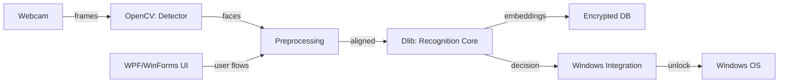

# ░▒▓ ROADMAP ▓▒░

                       _FaceLess-authenticator_

          An infographic-style roadmap for the FaceLess Windows authenticator

--------------------------------------------------------------------------------

## Project Overview

FaceLess-authenticator provides a privacy-first facial-recognition sign-in experience for Windows. It captures live video, extracts robust face embeddings, and authorizes users locally — removing passwords for everyday workflows while keeping biometric data on-device.

--------------------------------------------------------------------------------

## Current Architecture (visual)

  [WEB CAM] ---> 👁️  Real-Time Capture Module  ---> 🧠  Recognition Core  ---> ⚙️  Windows Integration
                   (video + detection)             (embeddings + matching)     (OS auth bridge)

  🎨 UI/UX (WPF/WinForms): Enrollment & status panels (guides users via prompts & progress bars)

-- Components (emoji + short visual block)

### 👁️ Real-Time Capture Module
```
• Captures video stream (OpenCV)
• Face detection (Haar / DNN / cascades)
• Preprocessing: alignment, cropping, lighting normalization
• Low-latency pipeline to forward frames to recognition core
```

### 🧠 Recognition Core
```
• Generates face embeddings (Dlib / deep models)
• Compares embeddings to local DB (cosine / Euclidean distance)
• Liveness checks and multi-pose aggregation for robustness
• Stores encrypted templates locally (DPAPI or encrypted file)
```

### ⚙️ Windows Integration Layer
```
• Hooks into login flow (WinAPI / Credential Provider)
• Sends secure auth decisions to OS
• Handles session unlocks and error fallback to password
```

### 🎨 UI/UX (WPF / WinForms)
```
• Enrollment wizard (5 pose capture guidance)
• Live camera preview with guidance overlays
• Audit / reenroll / remove identity controls
```

--------------------------------------------------------------------------------

## ASCII Roadmap Timeline

```
 [Now]
  │
  ├─ Deploy: Local prototype (OpenCV + Dlib) ✅
  │
  ├─ Stabilize: Liveness + multi-pose enrollment ✅
  │
  ├─ Harden: Encrypted templates + DPAPI ✅
  │
  └─ Next → Windows Hello Integration (see Future Updates) 🚀
```

--------------------------------------------------------------------------------

## 🔮 FUTURE UPDATES — Major Highlight 🚀🔥

**Windows Hello Integration**

```diff
+ [Planned] Build a standalone Windows executable (.exe) that integrates with Windows Hello APIs
+ - Provide users with a downloadable installer for systems without native Hello support
+ - Implement a Credential Provider shim or companion service bridging FaceLess to WinAuth
+ - Ensure secure key/material handling and OS-compliant attestation where possible
```

Why this matters:

- Extends biometric UX to more devices
- Offers a drop-in Hello-like experience without requiring hardware vendor support
- Improves adoption by matching platform expectations for security and UX

--------------------------------------------------------------------------------

## Design & Visuals

ASCII Logo (tiny):

```
    .----.  .----.  .----.  .----.
   /  .--.\/  .--.\/  .--.\/  .--.\
  |  |    ||  |    ||  |    ||  |  |
   \  '--'\  '--'\  '--'\  '--' /
    '----'  '----'  '----'  '----'
```

Tech badges:

  

Architecture diagram (mermaid):



--------------------------------------------------------------------------------

## Tone & Engagement

FaceLess-authenticator is designed to be pragmatic and community-driven. The roadmap is intentionally iterative: deliver a secure local experience first, then expand platform integration.

We welcome feedback, ideas, and code contributions — issues, PRs, and discussions are all encouraged.

Contribute & follow:
- GitHub Issues: https://github.com/SpicychieF05/Face-authentication-app/issues
- Pull Requests: Fork → Implement → PR

--------------------------------------------------------------------------------

Thank you — let’s make on-device face authentication simple, secure, and accessible. ✨

